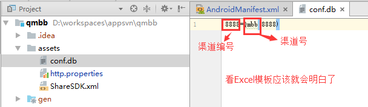
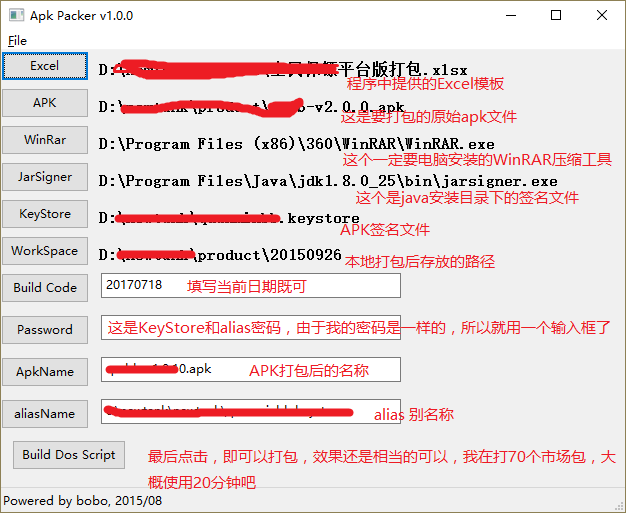
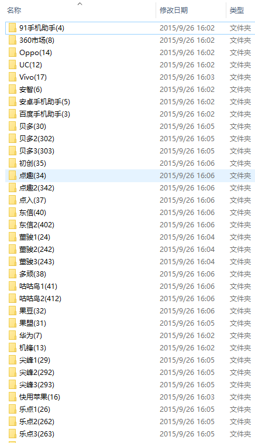

# ApkPacker
android 市场渠道号打包工具

## 开发流程

###### 1、安装[Eclipse](https://www.eclipse.org/downloads/)开发工具

###### 2、安装Python程序开发的lib包

	1. python-2.7.10.msi
	2. wxPython3.0-win64-3.0.2.0-py27.exe
	3. py2exe-0.6.10dev.win-amd64-py2.7.exe
	4. xlrd-0.9.4
	5. pip-7.1.0
	6. PyDev 4.2.0
	7. ez_setup-0.9

###### 3、拉取代码

	> git clone https://github.com/jiangqingbo/ApkPacker.git

###### 4、导入项目到Eclipse中，注意：在APK包文件中的assets目录下添加 “conf.db” 文件，一行内容：8888=app(8888)

###### 5、然后直接点击run, 出现如下图效果， 效果图给出了详细的说明，注意：尽量使用项目中给出的“市场渠道包.xlsx”模板

###### 6、最终打包好的文件夹

